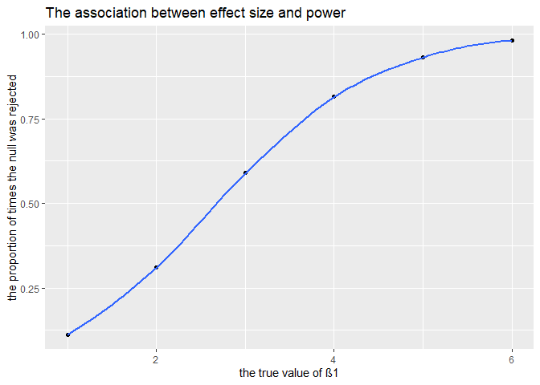
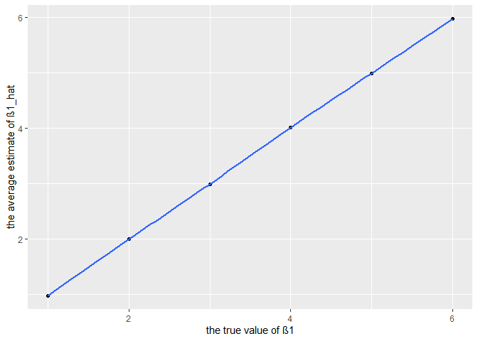
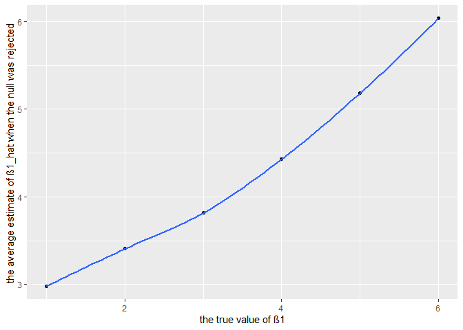

p8105\_hw5\_yj2580
================
yj2580
11/5/2019

## Problem 1

``` r
iris_with_missing = iris %>% 
  map_df(~replace(.x, sample(1:150, 20), NA)) %>%
  mutate(Species = as.character(Species))

fill_value = function(x) {
  if(is.character(x)) {
   x = replace_na(x, "virginica")
  } else if(is.numeric(x)){
   mean = round(mean(x, na.rm = TRUE),1)
   x = replace_na(x, mean)
  }
}
iris_new = map_dfr(iris_with_missing, fill_value)

head(iris_new, 10) %>%
  knitr::kable()
```

| Sepal.Length | Sepal.Width | Petal.Length | Petal.Width | Species |
| -----------: | ----------: | -----------: | ----------: | :------ |
|          5.1 |         3.5 |          1.4 |         0.2 | setosa  |
|          4.9 |         3.0 |          1.4 |         0.2 | setosa  |
|          4.7 |         3.2 |          1.3 |         0.2 | setosa  |
|          4.6 |         3.1 |          1.5 |         1.2 | setosa  |
|          5.0 |         3.6 |          1.4 |         0.2 | setosa  |
|          5.4 |         3.9 |          1.7 |         0.4 | setosa  |
|          5.8 |         3.4 |          1.4 |         0.3 | setosa  |
|          5.0 |         3.4 |          1.5 |         0.2 | setosa  |
|          4.4 |         2.9 |          1.4 |         0.2 | setosa  |
|          4.9 |         3.1 |          3.8 |         0.1 | setosa  |

## Problem 2

``` r
list1 = list.files(path = "data")
data = purrr::map_dfr(str_c("./data/", list1), read_csv) %>%
  mutate(name = list1, 
         name = str_replace(name, ".csv", "")
  ) %>%
  separate(name, into = c("arm", "id"), sep = "_") %>%
  mutate(arm = factor(arm), 
         id = factor(id)) %>%
  select(arm, id, everything()) %>%
  pivot_longer(week_1:week_8,
              names_to = "week",
              names_prefix = "week_",
              values_to = "observation")
```

    ## Parsed with column specification:
    ## cols(
    ##   week_1 = col_double(),
    ##   week_2 = col_double(),
    ##   week_3 = col_double(),
    ##   week_4 = col_double(),
    ##   week_5 = col_double(),
    ##   week_6 = col_double(),
    ##   week_7 = col_double(),
    ##   week_8 = col_double()
    ## )
    ## Parsed with column specification:
    ## cols(
    ##   week_1 = col_double(),
    ##   week_2 = col_double(),
    ##   week_3 = col_double(),
    ##   week_4 = col_double(),
    ##   week_5 = col_double(),
    ##   week_6 = col_double(),
    ##   week_7 = col_double(),
    ##   week_8 = col_double()
    ## )
    ## Parsed with column specification:
    ## cols(
    ##   week_1 = col_double(),
    ##   week_2 = col_double(),
    ##   week_3 = col_double(),
    ##   week_4 = col_double(),
    ##   week_5 = col_double(),
    ##   week_6 = col_double(),
    ##   week_7 = col_double(),
    ##   week_8 = col_double()
    ## )
    ## Parsed with column specification:
    ## cols(
    ##   week_1 = col_double(),
    ##   week_2 = col_double(),
    ##   week_3 = col_double(),
    ##   week_4 = col_double(),
    ##   week_5 = col_double(),
    ##   week_6 = col_double(),
    ##   week_7 = col_double(),
    ##   week_8 = col_double()
    ## )
    ## Parsed with column specification:
    ## cols(
    ##   week_1 = col_double(),
    ##   week_2 = col_double(),
    ##   week_3 = col_double(),
    ##   week_4 = col_double(),
    ##   week_5 = col_double(),
    ##   week_6 = col_double(),
    ##   week_7 = col_double(),
    ##   week_8 = col_double()
    ## )
    ## Parsed with column specification:
    ## cols(
    ##   week_1 = col_double(),
    ##   week_2 = col_double(),
    ##   week_3 = col_double(),
    ##   week_4 = col_double(),
    ##   week_5 = col_double(),
    ##   week_6 = col_double(),
    ##   week_7 = col_double(),
    ##   week_8 = col_double()
    ## )
    ## Parsed with column specification:
    ## cols(
    ##   week_1 = col_double(),
    ##   week_2 = col_double(),
    ##   week_3 = col_double(),
    ##   week_4 = col_double(),
    ##   week_5 = col_double(),
    ##   week_6 = col_double(),
    ##   week_7 = col_double(),
    ##   week_8 = col_double()
    ## )
    ## Parsed with column specification:
    ## cols(
    ##   week_1 = col_double(),
    ##   week_2 = col_double(),
    ##   week_3 = col_double(),
    ##   week_4 = col_double(),
    ##   week_5 = col_double(),
    ##   week_6 = col_double(),
    ##   week_7 = col_double(),
    ##   week_8 = col_double()
    ## )
    ## Parsed with column specification:
    ## cols(
    ##   week_1 = col_double(),
    ##   week_2 = col_double(),
    ##   week_3 = col_double(),
    ##   week_4 = col_double(),
    ##   week_5 = col_double(),
    ##   week_6 = col_double(),
    ##   week_7 = col_double(),
    ##   week_8 = col_double()
    ## )
    ## Parsed with column specification:
    ## cols(
    ##   week_1 = col_double(),
    ##   week_2 = col_double(),
    ##   week_3 = col_double(),
    ##   week_4 = col_double(),
    ##   week_5 = col_double(),
    ##   week_6 = col_double(),
    ##   week_7 = col_double(),
    ##   week_8 = col_double()
    ## )
    ## Parsed with column specification:
    ## cols(
    ##   week_1 = col_double(),
    ##   week_2 = col_double(),
    ##   week_3 = col_double(),
    ##   week_4 = col_double(),
    ##   week_5 = col_double(),
    ##   week_6 = col_double(),
    ##   week_7 = col_double(),
    ##   week_8 = col_double()
    ## )
    ## Parsed with column specification:
    ## cols(
    ##   week_1 = col_double(),
    ##   week_2 = col_double(),
    ##   week_3 = col_double(),
    ##   week_4 = col_double(),
    ##   week_5 = col_double(),
    ##   week_6 = col_double(),
    ##   week_7 = col_double(),
    ##   week_8 = col_double()
    ## )
    ## Parsed with column specification:
    ## cols(
    ##   week_1 = col_double(),
    ##   week_2 = col_double(),
    ##   week_3 = col_double(),
    ##   week_4 = col_double(),
    ##   week_5 = col_double(),
    ##   week_6 = col_double(),
    ##   week_7 = col_double(),
    ##   week_8 = col_double()
    ## )
    ## Parsed with column specification:
    ## cols(
    ##   week_1 = col_double(),
    ##   week_2 = col_double(),
    ##   week_3 = col_double(),
    ##   week_4 = col_double(),
    ##   week_5 = col_double(),
    ##   week_6 = col_double(),
    ##   week_7 = col_double(),
    ##   week_8 = col_double()
    ## )
    ## Parsed with column specification:
    ## cols(
    ##   week_1 = col_double(),
    ##   week_2 = col_double(),
    ##   week_3 = col_double(),
    ##   week_4 = col_double(),
    ##   week_5 = col_double(),
    ##   week_6 = col_double(),
    ##   week_7 = col_double(),
    ##   week_8 = col_double()
    ## )
    ## Parsed with column specification:
    ## cols(
    ##   week_1 = col_double(),
    ##   week_2 = col_double(),
    ##   week_3 = col_double(),
    ##   week_4 = col_double(),
    ##   week_5 = col_double(),
    ##   week_6 = col_double(),
    ##   week_7 = col_double(),
    ##   week_8 = col_double()
    ## )
    ## Parsed with column specification:
    ## cols(
    ##   week_1 = col_double(),
    ##   week_2 = col_double(),
    ##   week_3 = col_double(),
    ##   week_4 = col_double(),
    ##   week_5 = col_double(),
    ##   week_6 = col_double(),
    ##   week_7 = col_double(),
    ##   week_8 = col_double()
    ## )
    ## Parsed with column specification:
    ## cols(
    ##   week_1 = col_double(),
    ##   week_2 = col_double(),
    ##   week_3 = col_double(),
    ##   week_4 = col_double(),
    ##   week_5 = col_double(),
    ##   week_6 = col_double(),
    ##   week_7 = col_double(),
    ##   week_8 = col_double()
    ## )
    ## Parsed with column specification:
    ## cols(
    ##   week_1 = col_double(),
    ##   week_2 = col_double(),
    ##   week_3 = col_double(),
    ##   week_4 = col_double(),
    ##   week_5 = col_double(),
    ##   week_6 = col_double(),
    ##   week_7 = col_double(),
    ##   week_8 = col_double()
    ## )
    ## Parsed with column specification:
    ## cols(
    ##   week_1 = col_double(),
    ##   week_2 = col_double(),
    ##   week_3 = col_double(),
    ##   week_4 = col_double(),
    ##   week_5 = col_double(),
    ##   week_6 = col_double(),
    ##   week_7 = col_double(),
    ##   week_8 = col_double()
    ## )

``` r
head(data, 10) %>%
  knitr::kable()
```

| arm | id | week | observation |
| :-- | :- | :--- | ----------: |
| con | 01 | 1    |        0.20 |
| con | 01 | 2    |      \-1.31 |
| con | 01 | 3    |        0.66 |
| con | 01 | 4    |        1.96 |
| con | 01 | 5    |        0.23 |
| con | 01 | 6    |        1.09 |
| con | 01 | 7    |        0.05 |
| con | 01 | 8    |        1.94 |
| con | 02 | 1    |        1.13 |
| con | 02 | 2    |      \-0.88 |

``` r
data %>%
  group_by(id) %>%
  ggplot(aes(x = week, y = observation, colour = id, group = id)) +
  geom_point() +
  geom_line() + 
  facet_grid(.~arm) +
  labs(title = "Observations on each subject over time in different groups")
```

<!-- -->

Comment: Compared with the control arm group, there is an obviously
increasing trend of observation in the experiment arm group. Overall,
the average values of observations are higher in the experiment arm
group.

## Problem 3

``` r
sim_regression = function(beta1, n = 30, beta0 = 2) {
  sim_data = tibble(
    x = rnorm(n, mean = 0, sd = 1),
    y = beta0 + beta1 * x + rnorm(n, 0, sqrt(50))
  )
  
  ls_fit = lm(y ~ x, data = sim_data) %>%
    broom::tidy() %>%
    filter(term == "x") %>%
    select(estimate, p.value) %>%
    rename(beta1_hat = estimate,
           p_value = p.value)
}
  
output = vector("list", 10000)

for (i in 1:10000) {
  output[[i]] = sim_regression(beta1 = 0)
}

sim_results = bind_rows(output)
```

``` r
output = vector("list", length = 6)

for (i in 1:6) {
  output[[i]] = rerun(10000, sim_regression(i)) %>% 
  bind_rows
}

tibble(beta1 = 1:6,
       sim_results = output) %>%
  unnest(sim_results) %>%
  group_by(beta1) %>%
  summarise(prop = sum(p_value<0.05)/n()) %>%
  ggplot(aes(x = beta1, y = prop)) +
  geom_point() +
  geom_smooth() +
  labs(x = "the true value of β1", y = "the proportion of times the null was rejected", title = "The association between effect size and power")
```

    ## `geom_smooth()` using method = 'loess' and formula 'y ~ x'

    ## Warning in simpleLoess(y, x, w, span, degree = degree, parametric =
    ## parametric, : Chernobyl! trL>n 6
    
    ## Warning in simpleLoess(y, x, w, span, degree = degree, parametric =
    ## parametric, : Chernobyl! trL>n 6

    ## Warning in sqrt(sum.squares/one.delta): NaNs produced

    ## Warning in stats::qt(level/2 + 0.5, pred$df): NaNs produced

<!-- -->

Comments: As the effect size increases, the power goes up. However, the
growth rate starts to decrease from a certain point.

``` r
tibble(beta1 = 1:6,
       sim_results = output) %>%
  unnest(sim_results) %>%
  group_by(beta1) %>%
  summarise(avg_beta1_hat = mean(beta1_hat)) %>%
  ggplot(aes(y = avg_beta1_hat, x = beta1)) +
  geom_point() +
  geom_smooth() +
  labs(y = "the average estimate of β1_hat", x = "the true value of β1")
```

    ## `geom_smooth()` using method = 'loess' and formula 'y ~ x'

    ## Warning in simpleLoess(y, x, w, span, degree = degree, parametric =
    ## parametric, : Chernobyl! trL>n 6
    
    ## Warning in simpleLoess(y, x, w, span, degree = degree, parametric =
    ## parametric, : Chernobyl! trL>n 6

    ## Warning in sqrt(sum.squares/one.delta): NaNs produced

    ## Warning in stats::qt(level/2 + 0.5, pred$df): NaNs produced

<!-- -->

``` r
tibble(beta1 = 1:6,
       sim_results = output) %>%
  unnest(sim_results) %>%
  filter(p_value<0.05) %>%
  group_by(beta1) %>%
  summarise(avg_beta1_hat = mean(beta1_hat)) %>%
  ggplot(aes(y = avg_beta1_hat, x = beta1)) +
  geom_point() +
  geom_smooth() +
  labs(y = "the average estimate of β1_hat when the null was rejected ", x = "the true value of β1")
```

    ## `geom_smooth()` using method = 'loess' and formula 'y ~ x'

    ## Warning in simpleLoess(y, x, w, span, degree = degree, parametric =
    ## parametric, : Chernobyl! trL>n 6
    
    ## Warning in simpleLoess(y, x, w, span, degree = degree, parametric =
    ## parametric, : Chernobyl! trL>n 6

    ## Warning in sqrt(sum.squares/one.delta): NaNs produced

    ## Warning in stats::qt(level/2 + 0.5, pred$df): NaNs produced

<!-- -->

Comments: The sample average of estimation of β1 across tests for which
the null is rejected is higher than the true value of β1 when the true
value of β1 is small, from 1 to 4. However, two values are approximately
equal when the true value is relatively higher, from 5 to 6. As the true
value of β1 (effect size) increases, its power increases and we are more
likely to reject the null. Therefore, We have a larger sample size when
true value of β1 is high, as shown below. Given that estimates follow a
Normal distribution, the sample mean provides a good estimate of
population mean as sample size increases, so the mean of estimates will
be closer to the true value.

``` r
tibble(beta1 = 1:6,
       sim_results = output) %>%
  unnest(sim_results) %>%
  filter(p_value<0.05) %>%
  group_by(beta1) %>%
  summarise(n = n()) %>%
  knitr::kable()
```

| beta1 |    n |
| ----: | ---: |
|     1 | 1126 |
|     2 | 3107 |
|     3 | 5893 |
|     4 | 8145 |
|     5 | 9310 |
|     6 | 9803 |
